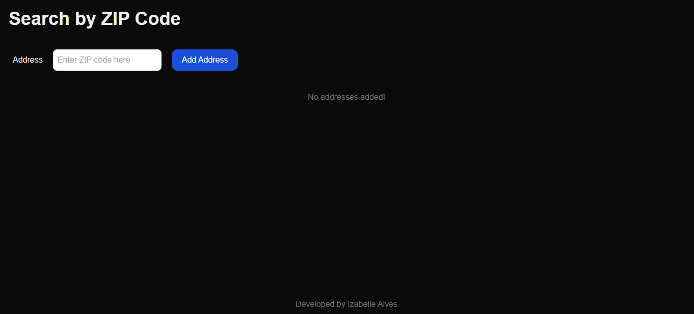
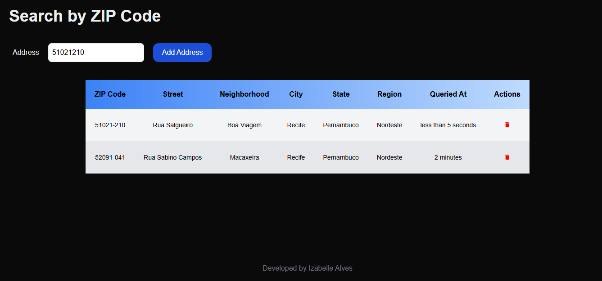
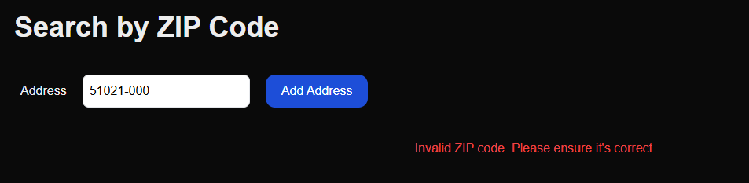
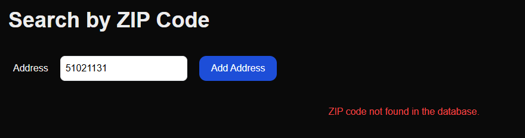

# Search by ZIP Code

This project is a React component for searching and managing addresses based on the user's ZIP code.




## Features

1. **Search Address by ZIP Code**

   - The user enters a ZIP code and searches for the associated address.
   - The address will be displayed in a table with detailed information.

2. **ZIP Code Validation**

   - Only valid ZIP codes (8 numerical digits and existing in the database) are accepted.

3. **List Searched Addresses**

   - Searched addresses are displayed in a table, organized from the most recent to the oldest.

4. **Delete Address from the Table**

   - The user can remove addresses from the table.

5. **Error Feedback**

   - Displays clear messages if the ZIP code is invalid or not found.

   
   

6. **Display Time Since the Query**
   - The query date is displayed in the format "X minutes ago" or "Y seconds ago."

---

## Technologies and Tools

### **Libraries Used**

- **React**: Main framework for creating interfaces.
- **React Icons (`react-icons`)**: To display icons, such as the delete button.
- **date-fns**: For date manipulation and formatting.
  - `formatDistanceToNow` to calculate relative time.
  - `ptBR` for localization in Brazilian Portuguese.
- **uuid**: To generate unique IDs for each address.
- **Tailwind CSS**: Simplified and responsive styling.

### **API Request**

- **Function `getAddress`**:  
  An asynchronous function that fetches address data based on the ZIP code.

---

## Code Structure

### **Types and States**

- **`type Address`**: Defines the data structure of an address.  
  Includes fields like `cep`, `logradouro`, `bairro`, and `uf`.

- **States in the `Cep` Component**:
  - `address`: Stores the address returned by the search.
  - `inputValue`: Controls the value entered in the input field.
  - `loading`: Indicates the loading state during the search.
  - `error`: Error message displayed to the user.
  - `copyAddress`: List of searched addresses.

---

### **Main Functions**

#### **1. `handleGetAddress`**

- **Purpose**: Fetch the address based on the provided ZIP code.
- **Validations**: Ensures the ZIP code has 8 numerical characters.
- **Flow**:
  - Calls the API using the `getAddress` function.
  - Adds the returned address to the `copyAddress` list.
  - Displays error messages if the ZIP code is invalid or not found.

#### **2. `handleDeleteAddress`**

- **Purpose**: Remove an address from the list based on its `id`.
- **Flow**:
  - Filters the `copyAddress` array to exclude the corresponding address.

#### **3. `formatDate`**

- **Purpose**: Format the address creation date in a relative format.
- **Flow**:
  - Uses the `formatDistanceToNow` function from the `date-fns` library.

---

## How to Use

1. Clone this repository:
   ```bash
   git clone <https://github.com/IzabelleAlves/Search-by-ZIP-code>
   ```
2. Install dependencies:
   ```bash
   npm install
   ```
3. Run the project:
   ```bash
   npm run dev
   ```

**_Contact Me_**

- **E-mail**: [izabelle.alvesbl@gmail.com](mailto:izabelle.alvesbl@gmail.com)
- **LinkedIn**: [Izabelle Alves](https://www.linkedin.com/in/izabellealvess/)
